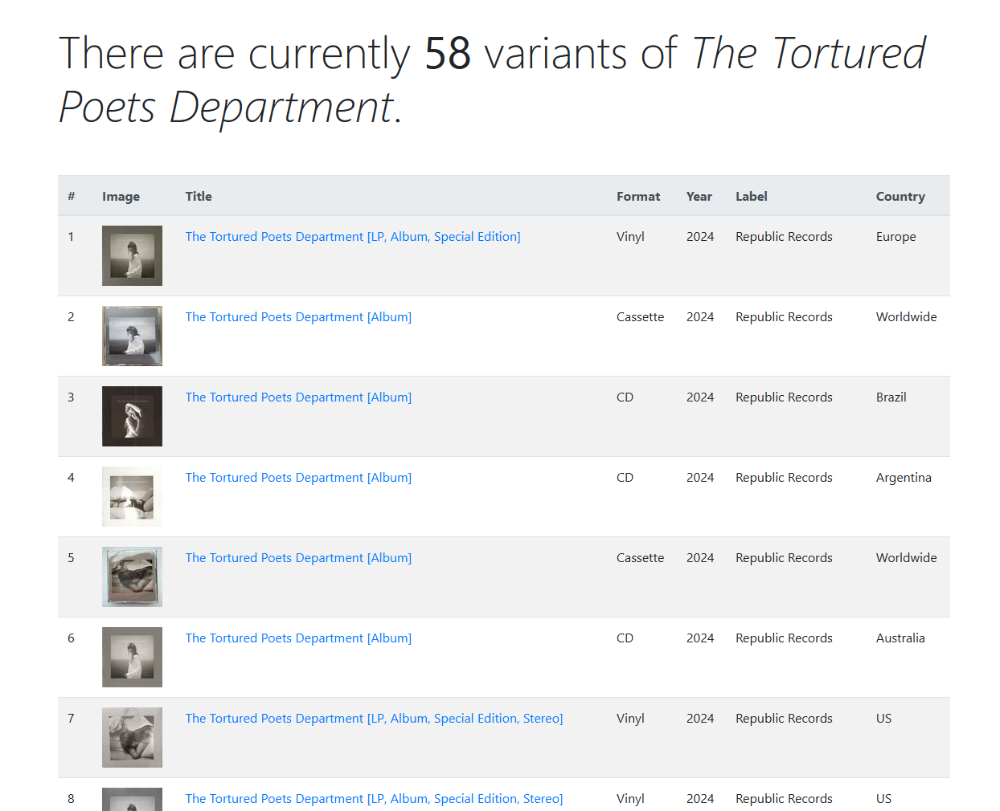

# TTPD Variant Tracker
Tracks the total number of different versions of Taylor Swift's *The Tortured Poets Department*. Data sourced from [Discogs](https://www.discogs.com/release/30486003-Taylor-Swift-The-Tortured-Poets-Department).

---

*As featured in [Salon!](https://www.salon.com/2024/06/15/fans-are-accusing-taylor-swift-of-intentionally-blocking-charli-xcx-from-a-1-debut/)*

*This is just a screenshot, not the up-to-date count!*

---

## Setup instructions
- Clone this repository somewhere
- `cd` to the directory containing `app.js`
- Create a file called `.env` containing the following lines:
  - `PORT=3000` (or whatever you want)
  - `DISCOGS_TOKEN=` (get your token [here](https://www.discogs.com/settings/developers))
- In your command prompt run
  - `npm install`
  - `npm run dev`
- Navigate to [http://localhost:PORT](http://localhost:PORT) in your browser (3000 by default)